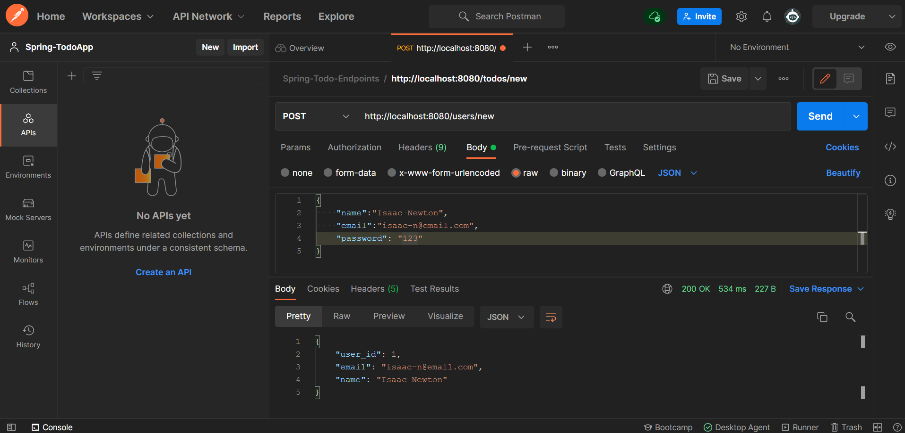
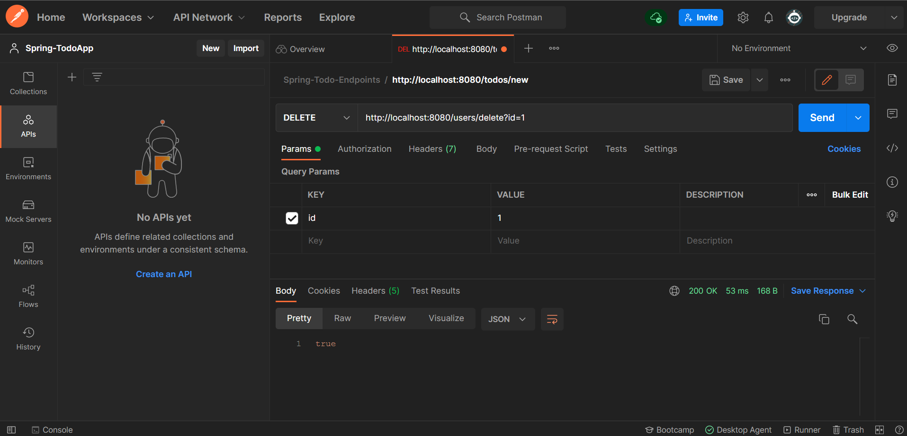
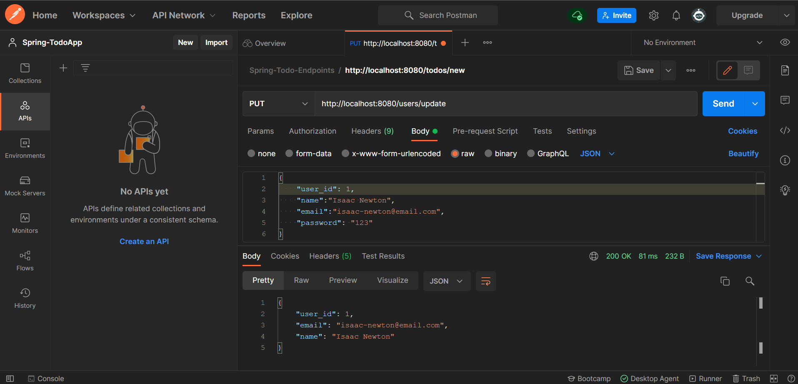

## Why are we doing this?
### This project helps solidy our knowledge of Java Spring Boot for Backend Applications.
### This Application is a Simple TODO Application however 2 Database Tables were used with a Foreign Key Relationship.
### This is a bit more advanced than a scenario where only database table was used to persist the Database Entities.
### This skills demonstarted in this project are applicable & transferable to larger projects with multiple tables & complex joins. 

## How I expected the challenge to go.
### I expected the challenge to go pretty smoothly given my previous knowledge of Python programming.
### This was not the case however. The integration testing of Spring Boot Applications is very brittle & difficult to get right.
### It also seems that differnt IDEs are more suited to diffent aspects of the development & build of a Spring Boot Application.

## What went well? / What didn't go as planned?
# What went well
### The understanding of the concepts of Java as an Object Oriented Program was smooth. I assess as "Well" received.

# what didn't go so well
### The Integration Testing of Java Spring Boot Applications is not a smooth process & seems to be poorly documented. 
### Even with the use of Spring official Documentation.

## Possible improvements for future revisions of the project.
### I would suggest more documentation on the Integration Aspects of the Project.

## Screenshots showing your postman requests and the output from the API.

###POST Request: Adding a New User

###DELETE Request: Deleting a User

###PUT Request: Adding a New User

## Screenshots of your database to prove that data is being persisted.

## Screenshot of your test results, including coverage report.

### Link to Jira Board
(My Jira Board)[https://georgekpai.atlassian.net/jira/software/projects/GDS/boards/1]
